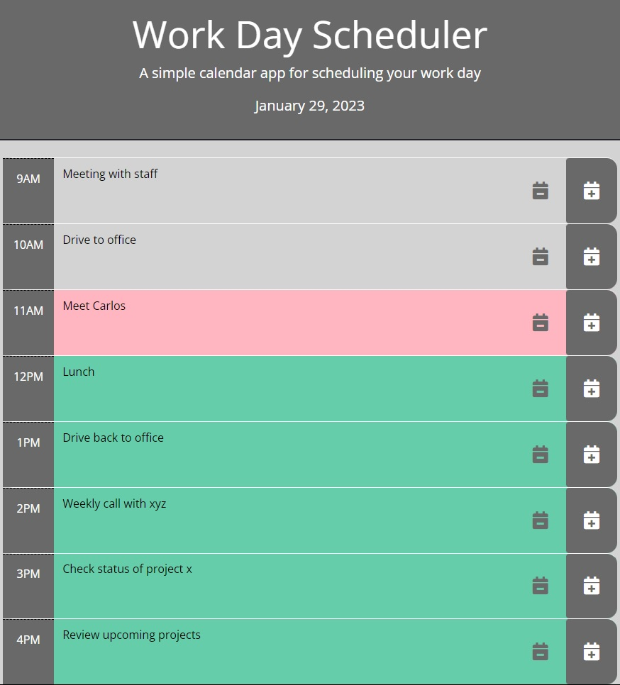

# Work Day Scheduler

In this page you can find third party libraries that were used to format dates (Dayjs) to be able to conditional format the calendar along with displaying current date. Additionally other libraries were used to build functionality (Jquery) along with other libraries for formatting (Bootstrap, Fonteawesome).

### Webpage Link
https://arlindo2017.github.io/work-day-scheduler/

### GitHub Repo
https://github.com/arlindo2017/work-day-scheduler

### Webpage Picture

## Skills on display
- Jquery
- Dom elements
- Click event functions
- Bootstrat Modal windows
- Dayjs date formatting
- Fontawesome icons
- User data validation